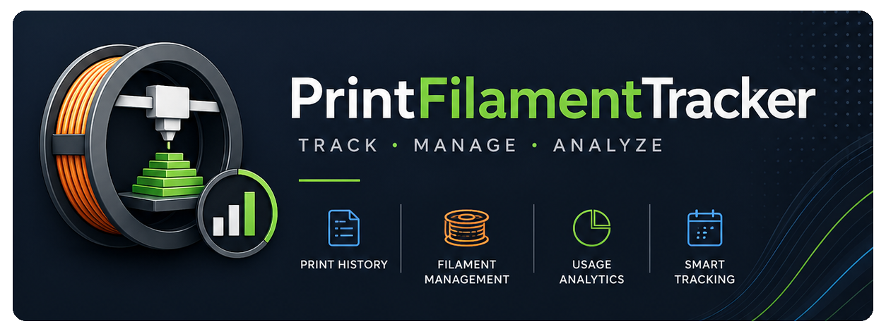

# PrintFilamentTracker




**個人本機工具**，專為單一用戶在自己的電腦上管理 Bambu Lab 3D 列印機的列印歷史與耗材（Filament Spool）。

> **定位說明**：PrintFilamentTracker 設計為個人本機使用（personal, local, single-user）工具——所有列印歷史與耗材資料僅儲存於您自己的裝置（本機 SQLite），不進行資料蒐集、分析或第三方共享。本軟體仍會透過您的帳號憑證與 Bambu Cloud 通訊以取得列印記錄，詳見 [DISCLAIMER.md](DISCLAIMER.md)。此使用情境與 GDPR Article 2(2)(c) 個人家庭活動豁免條件相符，但能否適用取決於實際使用情境，使用者應自行評估。

> **⚠ 免責聲明**
> PrintFilamentTracker 是獨立的社群專案，**與 Bambu Lab Co., Ltd. 無任何關聯、背書或贊助關係**。
> "Bambu"、"Bambu Lab" 為 Bambu Lab Co., Ltd. 的商標，僅用於描述本軟體所整合的第三方服務。
>
> 本軟體透過**非官方 API 端點**存取 Bambu Cloud。根據 [Bambu Lab 服務條款](https://bambulab.com/en-us/policies/terms)（2024 年 4 月 24 日版）：
> - **§3.1** 禁止未經 Bambu Lab 事先同意，使用其技術或 IP 開發第三方軟體
> - **§3.4** 禁止逆向工程或以任何方式對產品建立衍生品
> - **§11.1** 違反條款可能導致 **Bambu 帳號被停用**
>
> - **2025 年 1 月起**，Bambu Lab 推出 Authorization Control System，於韌體層面限制未授權第三方工具存取（LAN 與 Cloud 雙模式）。未來可能影響本軟體的連線功能。
>
> 使用本軟體即代表您自行承擔相關法律與帳號風險。詳見 [DISCLAIMER.md](DISCLAIMER.md)。

## 功能

- **列印歷史**：從 Bambu Cloud 匯入並儲存列印記錄；支援手動新增任務
- **耗材管理**：追蹤每捲耗材的初始重量、使用量與剩餘量；自動計算狀態（sealed / active / low / empty）
- **耗材對應（Mapping）**：將列印任務中的耗材使用記錄對應到實體耗材捲
- **列印機管理**：記錄列印機資訊、使用統計
- **分析統計**：年度熱力圖、材料分布、月度趨勢、成本分析
- **資料庫備份**：手動或定時備份 SQLite 資料庫，支援一鍵還原
- **多語言**：繁體中文 / English，可自行擴充
- **深色 / 淺色主題**：瀏覽器主題自動偵測，手動切換

## 快速開始

### 環境需求

- Python 3.10+
- Windows 10/11 **或** macOS 12+（Monterey）

### 安裝與部署

#### Windows（一鍵）

```bash
git clone https://github.com/Ning0612/PrintFilamentTracker.git
cd PrintFilamentTracker

# 1. 建立虛擬環境並安裝依賴
python -m venv .venv
.venv\Scripts\python.exe -m pip install -r requirements.txt

# 2. 設定環境變數
copy .env.example .env
# 編輯 .env，至少填入 BAMBU_REGION=global（Token 可稍後在 Web 設定頁登入取得）
```

```powershell
# 3. 執行一鍵部署腳本（PowerShell，建議以系統管理員身份執行）
.\scripts\setup_deployment.ps1
```

#### macOS（一鍵）

```bash
git clone https://github.com/Ning0612/PrintFilamentTracker.git
cd PrintFilamentTracker

# 1. 建立虛擬環境並安裝依賴
python3 -m venv .venv
.venv/bin/python -m pip install -r requirements.txt

# 2. 設定環境變數
cp .env.example .env
# 編輯 .env，至少填入 BAMBU_REGION=global（Token 可稍後在 Web 設定頁登入取得）

# 3. 執行一鍵部署腳本
bash scripts/setup_deployment.sh
```

部署腳本會自動完成：
- 驗證並生成 `SECRET_KEY`
- 安裝 Waitress WSGI 伺服器
- 建立開機自動啟動任務（Windows：工作排程器；macOS：Launch Agent）
- 立即啟動 Web 伺服器（背景執行，不顯示 terminal 視窗）

腳本完成後，瀏覽器開啟 `http://127.0.0.1:5000`，在設定頁登入 Bambu 帳號即可開始使用。

## 文件

| 文件 | 說明 |
|------|------|
| [使用說明](docs/usage.md) | Web 介面各功能操作指南 |
| [部署指南](docs/deployment.md) | 生產環境部署、HTTPS、反向代理 |
| [架構說明](docs/architecture.md) | 模組設計、資料庫 Schema、API 介接 |
| [開發指南](docs/development.md) | 開發環境、新增功能、多語言、測試 |

## 技術棧

| 類別 | 技術 |
|------|------|
| 後端 | Python 3.10+, Flask 3.x |
| 前端 | Pico CSS v2, HTMX 1.9, 原生 JavaScript |
| 資料庫 | SQLite（`data/bambu.db`） |
| 安全 | Flask-WTF CSRF, Session cookie 防護, 圖片 magic bytes 驗證 |

## 目錄結構

```
PrintFilamentTracker/
├── src/            # 業務邏輯（無 Flask 依賴）
├── web/            # Flask 應用（routes, templates, i18n, static）
│   └── static/img/ # 品牌圖片（icon、banner）
├── scripts/        # 工具腳本（取得 Token）
├── data/           # 資料目錄（gitignored）
│   ├── bambu.db    # SQLite 資料庫
│   ├── covers/     # 封面圖片
│   ├── backups/    # 資料庫備份
│   └── logs/       # 應用日誌
├── docs/           # 技術文件
└── requirements.txt
```

## License

本專案採用 [PolyForm Noncommercial License 1.0.0](LICENSE) 授權。
**僅限非商業用途**（個人使用、研究、教育、非營利組織）。
商業用途需取得授權人書面同意。
