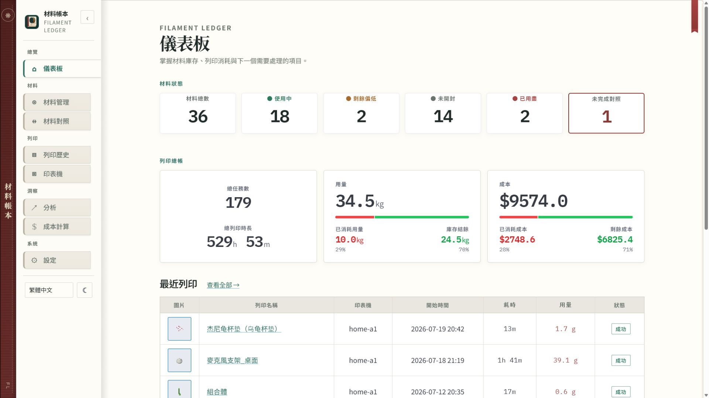
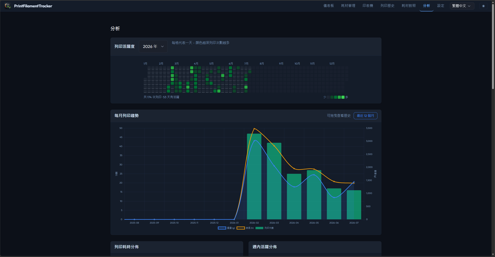
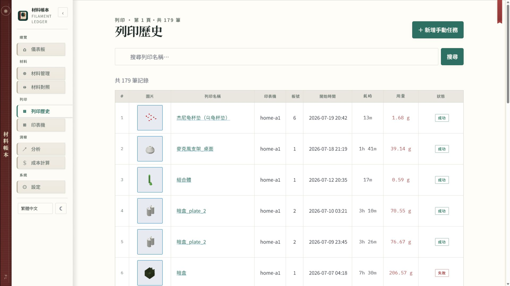
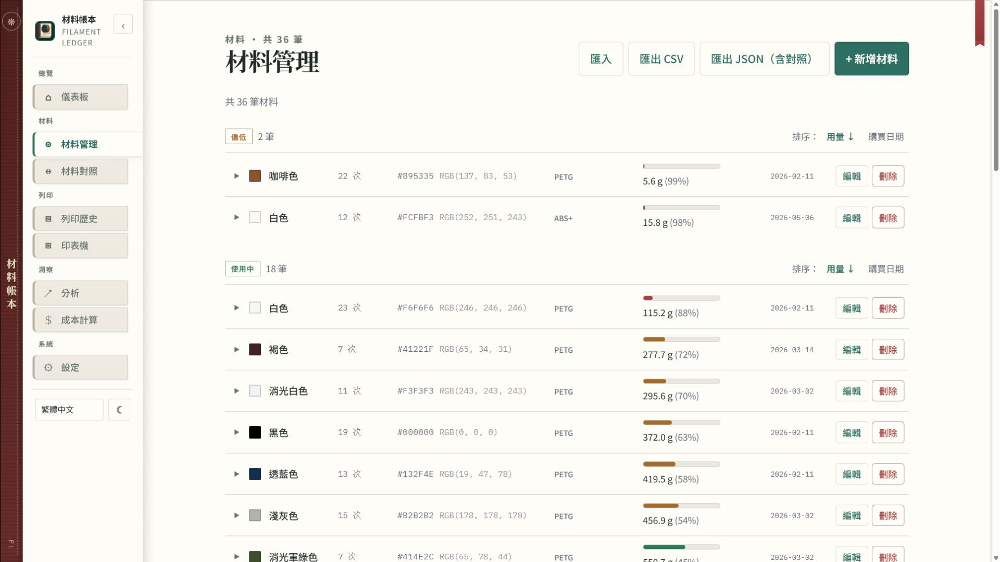

# Print Filament Tracker


[](https://github.com/Ning0612/print-filament-tracker/actions/workflows/ci.yml)
[](https://github.com/Ning0612/print-filament-tracker/actions/workflows/release.yml)

## Demo 截圖

已避開設備識別資訊，只保留對外展示需要的畫面。

| 儀表板 | 列印分析 |
|---|---|
|  |  |

| 列印歷史 | 耗材管理（裁切） |
|---|---|
|  |  |

**個人本機工具**，專為單一用戶在自己的電腦上管理 Bambu Lab 3D 列印機的列印歷史與耗材（Filament Spool）。

## 專案狀態

本專案是因個人管理 3D 列印耗材需求而製作的本機工具。若後續有新的實際需求或功能發想，會持續維護。

> **定位說明**：PrintFilamentTracker 設計為個人本機使用（personal, local, single-user）工具——所有列印歷史與耗材資料僅儲存於您自己的裝置（本機 SQLite），不進行資料蒐集、分析或第三方共享。本軟體仍會透過您的帳號憑證與 Bambu Cloud 通訊以取得列印記錄，詳見 [DISCLAIMER.md](DISCLAIMER.md)。此使用情境與 GDPR Article 2(2)(c) 個人家庭活動豁免條件相符，但能否適用取決於實際使用情境，使用者應自行評估。

> **⚠ 免責聲明**
> PrintFilamentTracker 是獨立的社群專案，**與 Bambu Lab Co., Ltd. 無任何關聯、背書或贊助關係**。
> "Bambu"、"Bambu Lab" 為 Bambu Lab Co., Ltd. 的商標，僅用於描述本軟體所整合的第三方服務。
>
> 本軟體透過**非官方 API 端點**存取 Bambu Cloud。根據 [Bambu Lab 服務條款](https://bambulab.com/en-us/policies/terms)（2024 年 4 月 24 日版）：
> - **§3.1** 禁止未經 Bambu Lab 事先同意，使用其技術或 IP 開發第三方軟體
> - **§3.4** 禁止逆向工程或以任何方式對產品建立衍生品
> - **§11.1** 違反條款可能導致 **Bambu 帳號被停用**
>
> - **2025 年 1 月起**，Bambu Lab 推出 Authorization Control System，於韌體層面限制未授權第三方工具存取（LAN 與 Cloud 雙模式）。未來可能影響本軟體的連線功能。
>
> 使用本軟體即代表您自行承擔相關法律與帳號風險。詳見 [DISCLAIMER.md](DISCLAIMER.md)。

## 功能

- **列印歷史**：從 Bambu Cloud 匯入並儲存列印記錄；支援手動新增任務；顯示列印狀態（completed / failed / 進行中）徽章與板片資訊
- **耗材管理**：追蹤每捲耗材的初始重量、使用量與剩餘量；自動計算狀態（sealed / active / low / empty）；耗材詳情頁顯示完整使用統計與列印歷史
- **耗材對應（Mapping）**：將列印任務中的耗材使用記錄對應到實體耗材捲；支援在任務詳情頁直接重新對應，無需跳轉
- **列印機管理**：記錄列印機資訊、使用統計
- **分析統計**：年度熱力圖（可點擊進入每日報告）、材料分布、月度趨勢（支援平移）、時長分布、週間活動、耗材成本排名
- **Dashboard 耗材經濟面板**：總重量 / 已用量 / 剩餘量統計，搭配進度條與成本分析
- **資料庫備份**：手動或定時備份 SQLite 資料庫；還原前自動備份、確認字詞防誤操作
- **時區設定**：在設定頁選擇 UTC 偏移，任務、分析等頁面的時間戳記自動轉換為本地時間
- **多語言**：繁體中文 / English，可自行擴充
- **深色 / 淺色主題**：瀏覽器主題自動偵測，手動切換

## 快速開始

### 系統需求

| 項目 | Windows | macOS |
|------|---------|-------|
| 作業系統 | Windows 10 / 11 | macOS 12（Monterey）以上 |
| 磁碟空間 | 300 MB | 300 MB |
| 記憶體 | 256 MB | 256 MB |
| 其他需求 | — | 無需安裝 Python |

**不需要安裝 Python**——執行檔已包含所有必要的執行環境。

### Windows 安裝

1. 從 [Releases](https://github.com/Ning0612/print-filament-tracker/releases) 頁面下載 `PrintFilamentTracker.exe`
2. 將 `.exe` 放置於任意目錄（建議 `C:\Users\你的名字\PrintFilamentTracker\`）
3. 雙擊執行

> **⚠ Windows SmartScreen 警告**：首次執行可能出現「Windows 已保護您的電腦」警告（因執行檔尚未數位簽章）。  
> 點擊「**其他資訊**」→「**仍要執行**」即可。

啟動後程式會自動：
- 在系統托盤（右下角）顯示圖示
- 啟動背景伺服器
- 開啟瀏覽器並前往 `http://127.0.0.1:7580`

首次使用請前往「**設定**」頁面登入 Bambu 帳號以取得 Access Token。

### macOS 安裝

1. 從 [Releases](https://github.com/Ning0612/print-filament-tracker/releases) 頁面下載 `PrintFilamentTracker.app.zip`
2. 解壓縮後將 `.app` 拖曳至任意目錄
3. **首次開啟**：右鍵點擊 `.app` → 選擇「**開啟**」→ 在對話框中確認開啟（繞過 Gatekeeper）

啟動後程式會在 Menu Bar（右上角）顯示圖示，並自動開啟瀏覽器。

### 資料儲存位置

程式資料（資料庫、日誌、設定）自動儲存於作業系統標準資料目錄：

| 作業系統 | 路徑 |
|---------|------|
| Windows | `%LOCALAPPDATA%\PrintFilamentTracker\` |
| macOS | `~/Library/Application Support/PrintFilamentTracker/` |

> **⚠ 憑證安全**：登入後，Bambu 存取 Token 以**明文**儲存於 `data/tracker.db`。請勿將資料目錄分享或同步至公開雲端服務。

### 常見問題

**防毒軟體誤判**：PyInstaller 打包的執行檔偶有誤報。若發生誤判，可暫時停用防毒後執行，或向防毒廠商回報誤報。自行建置版本（`-NoUpx`）誤報率較低。

**Port 7580 被占用**：在資料目錄的 `.env` 中加入 `PORT=<新port號>`，重啟程式後生效。

**Token 過期**：Bambu Cloud Token 有效期約 3 個月。到「設定」頁重新登入即可自動更新。

## 文件

| 文件 | 說明 |
|------|------|
| [使用說明](docs/usage.md) | Web 介面各功能操作指南 |
| [部署指南](docs/deployment.md) | 安裝、設定與進階選項 |
| [架構說明](docs/architecture.md) | 模組設計、資料庫 Schema、API 介接 |
| [開發指南](docs/development.md) | 開發環境、新增功能、多語言、測試 |
| [UI 設計規範](docs/ui-design-system.md) | Material Ledger 視覺語言、元件與 WebUI 遷移規則 |

## 技術棧

| 類別 | 技術 |
|------|------|
| 後端 | Python 3.10+, Flask 3.x, Waitress |
| 前端 | Pico CSS v2, HTMX 1.9, 原生 JavaScript |
| 資料庫 | SQLite（`data/tracker.db`） |
| 安全 | Flask-WTF CSRF, Session cookie 防護, 圖片 magic bytes 驗證 |
| 打包 | PyInstaller, pystray |

## 目錄結構

```
PrintFilamentTracker/
├── src/            # 業務邏輯（無 Flask 依賴）
├── web/            # Flask 應用（routes, templates, i18n, static）
│   └── static/img/ # 品牌圖片（icon、banner）
├── scripts/        # 建置與工具腳本
│   ├── build_exe.ps1   # Windows 建置腳本（PyInstaller + WiX MSI）
│   ├── build_exe.sh    # macOS 建置腳本（PyInstaller，支援 --version=）
│   └── get_token.py    # Bambu Cloud Token 取得工具（開發用）
├── tray_main.py    # 系統托盤入口點
├── PrintFilamentTracker.spec     # Windows PyInstaller spec
├── PrintFilamentTracker-mac.spec # macOS PyInstaller spec
├── installer/      # Windows MSI 安裝程式定義（WiX v4）
│   ├── Product.wxs # WiX 安裝精靈規格（含圖示、桌面捷徑、啟動選項）
│   └── license.rtf # 授權條款（PolyForm Noncommercial License 1.0.0）
├── data/           # 資料目錄（凍結版位於系統資料目錄）
├── docs/           # 技術文件
├── requirements.txt
└── requirements-dev.txt
```

## 自行建置

若需從原始碼建置執行檔，請參考 [開發指南](docs/development.md)。

```powershell
# Windows
.venv\Scripts\python.exe -m pip install -r requirements.txt
.\scripts\build_exe.ps1 -NoUpx -Version "1.2.0"
# 輸出：dist\PrintFilamentTracker.exe + dist\PrintFilamentTracker-1.2.0.msi
```

```bash
# macOS
.venv/bin/python -m pip install -r requirements.txt
bash scripts/build_exe.sh --version=1.2.0
# 輸出：dist/PrintFilamentTracker.app
```

## License

本專案採用 [PolyForm Noncommercial License 1.0.0](LICENSE) 授權。
**僅限非商業用途**（個人使用、研究、教育、非營利組織）。
商業用途需取得授權人書面同意。
